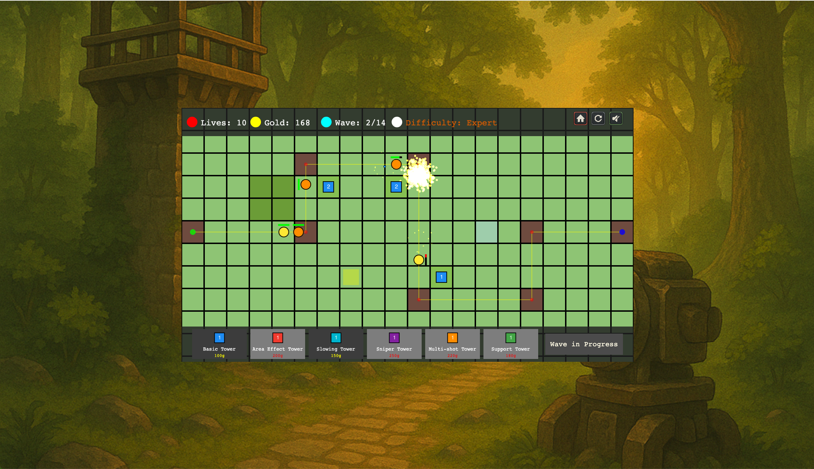
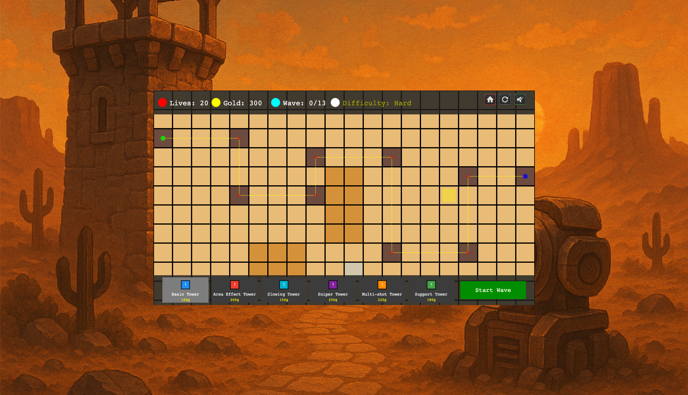
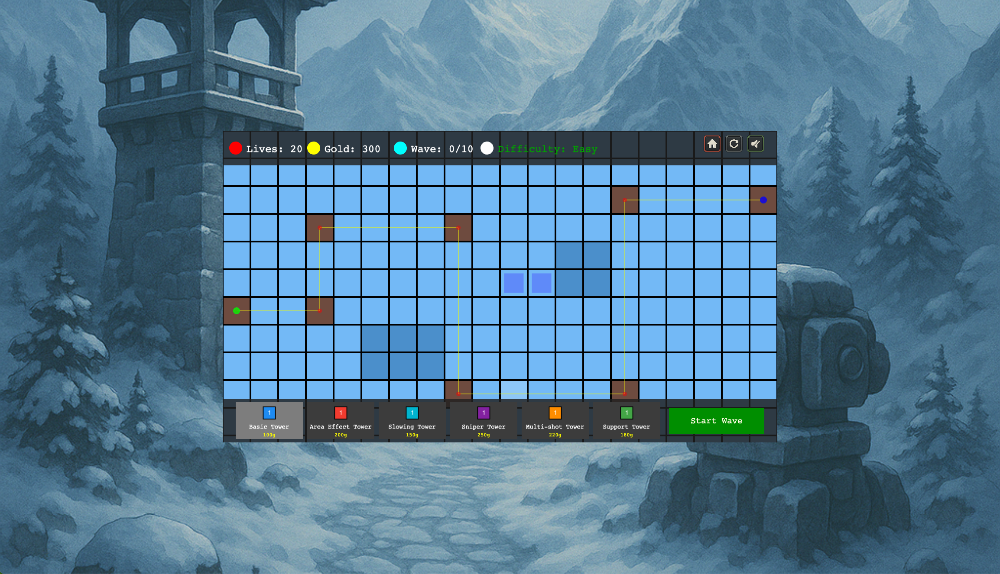

# Tower Defense Game

A modern, extensible tower defense game built with Phaser 3.88.2 and ES6 modules. Defend your base from waves of enemies by strategically placing, upgrading, and combining different types of towers. Designed for easy expansion and clean architecture.

Note: The complete code of this game was written by AI (mostly GPT-4.1 in Windsurf). Graphics: ChatGPT-4o. Sounds: ElevenLabs.

---

## Table of Contents

- [Features](#features)
- [Getting Started](#getting-started)
- [Commands](#commands)
- [Gameplay](#gameplay)
- [Assets](#assets)
- [Screenshots](#screenshots)
- [Tech Stack](#tech-stack)
- [Project Structure](#project-structure)
- [Contributing](#contributing)
- [License](#license)
- [Credits](#credits)

---

## Features

- **6 Tower Types**: Basic, Area Effect, Slowing, Sniper, Multi-shot, Support
- **Tower Upgrades**: Improve stats and visuals
- **Multiple Enemy Types**: Fast, armored, flying, healer, shield, split, teleport, boss
- **Visual & Audio Effects**: For attacks, deaths, upgrades, and UI
- **Manual & Automatic Wave Progression**
- **Map & Difficulty Selection**
- **Config-Driven Extensibility** for towers, enemies, waves, and maps
- **Clean, Event-Driven Architecture** for easy feature expansion

---

## Getting Started

### Prerequisites

- Node.js (v16+ recommended)
- npm

### Installation

```bash
git clone [your-repo-url]
cd tower-defence
npm install
```

### Running the Game

```bash
npm start
```
Open [http://localhost:8080](http://localhost:8080) in your browser.

### Building for Production

```bash
npm run build
```
Output will be in the `dist/` directory.

---

## Commands

- **npm start**  
  Start the development server with hot reload (default: http://localhost:8080).

- **npm run build**  
  Build the game for production (output in `dist/`).

- **npm run generate-assets**  
  Run the asset generator script (`src/assets-generator.js`) to create or process game assets.

- **npm test**  
  Placeholder test script (currently not implemented).

---

## Gameplay

### Objective

Defend your base from waves of enemies by building and upgrading towers. Survive all waves to win.

### How to Play

1. **Select a Tower**  
   Use the bottom bar to choose a tower type. Each tower has unique abilities and cost.

2. **Place Towers**  
   Click on a highlighted placement tile to build the selected tower. You must have enough gold.

3. **Upgrade Towers**  
   Click on a placed tower to view its info and upgrade it (if you have enough gold). Upgrades improve damage, range, and fire rate.

4. **Start Waves**  
   Press the "Start Wave" button to begin a new wave of enemies. Some waves start automatically.

5. **Defend Your Base**  
   Enemies follow the path to your base. If they reach the end, you lose lives. Lose all lives and it's game over.

6. **Earn Gold**  
   Defeating enemies grants gold, which you use to build and upgrade towers.

### Tower Types

- **Basic Tower**: Standard single-target attack.
- **Area Effect Tower**: Deals splash damage to groups.
- **Slowing Tower**: Slows enemies on hit.
- **Sniper Tower**: High damage, long range, slow fire rate.
- **Multi-shot Tower**: Attacks multiple targets at once.
- **Support Tower**: Buffs nearby towers' fire rate.

### Enemy Types

- **Basic**: Standard enemy.
- **Fast**: Moves quickly, low health.
- **Armored**: High health, reduced damage taken.
- **Flying**: Ignores some tower types.
- **Healer**: Periodically heals itself or nearby enemies.
- **Shield**: Temporarily immune to damage with an active shield.
- **Split**: Splits into smaller enemies upon death.
- **Teleport**: Periodically jumps ahead along the path.
- **Boss**: Very high health, strong, may combine special abilities.

### Tips & Strategy

- Mix tower types for best coverage.
- Upgrade towers to handle tougher waves.
- Place support towers to maximize buffs.
- Watch your gold and plan upgrades carefully.
- Some towers can't hit flying enemies—plan accordingly.

---

## Assets

Game assets are generated procedurally using the script in `src/assets-generator.js`.

- **Tiles:** Grass, desert, mountain, path, placement
- **Towers:** All types and upgrade levels
- **Enemies:** Basic, fast, armored, flying, boss, healer, shield, split, teleport
- **Projectiles:** Basic, AoE, slow, sniper, multishot
- **Effects:** Explosion, favicon

You can regenerate all assets with:

```bash
node src/assets-generator.js
```

Generated assets are placed in `public/assets/images/`.

---

## Screenshots

<p align="center">
  
</p>

<p align="center">
  
  
  
</p>

---

## Tech Stack

- [Phaser 3.88.2](https://phaser.io/)
- ES6 modules
- Webpack
- Babel
- Custom asset generator script

---

## Project Structure

- `src/` - Game source code (entities, systems, scenes, utilities, config)
- `public/` - Static assets and HTML entry point
- `docs/` - Design and planning documents
- `memory-bank/` - Project context and documentation

---

## Contributing

Pull requests and suggestions are welcome! Please see the `docs/` and `memory-bank/` folders for project context and guidelines.

---

## License

MIT License

---

## Credits

- Game design and code: [Your Name]
- Built with Phaser 3
