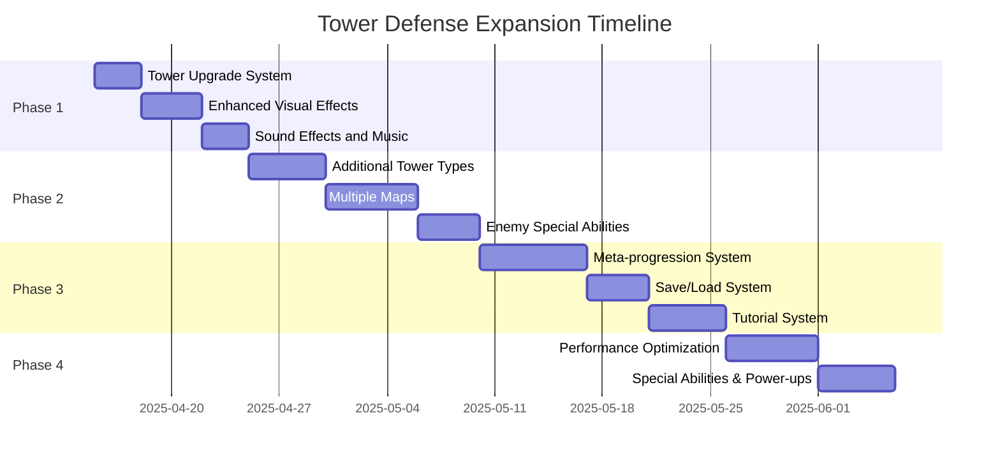

# Tower Defense Game Expansion Timeline

This document provides a high-level overview of the expansion plan timeline, organizing the features into phases with estimated completion dates.

## Overview

The expansion plan is divided into four phases, each building upon the previous one to gradually enhance the game's features, depth, and polish. The total estimated development time is approximately 52 days.

## Phase 1: Core Enhancement (10 days)

This phase focuses on enhancing the existing core gameplay with features that provide immediate value and build on the existing codebase.

| Feature | Description | Effort | Dependencies |
|---------|-------------|--------|--------------|
| Tower Upgrade System | Allow players to upgrade existing towers to improve their capabilities | 3 days | None |
| Enhanced Visual Effects | Improve visual feedback for game events | 4 days | Tower Upgrade System |
| Sound Effects and Music | Add audio feedback to enhance the game experience | 3 days | Enhanced Visual Effects |

**Phase 1 Deliverables:**
- Fully functional tower upgrade UI and mechanics
- Particle effects for tower attacks, enemy deaths, and game events
- Complete sound effect library and background music system

## Phase 2: Content Expansion (15 days)

This phase focuses on adding more content to increase gameplay variety and replayability.

| Feature | Description | Effort | Dependencies |
|---------|-------------|--------|--------------|
| Additional Tower Types | Add new tower types with unique abilities | 5 days | Phase 1 |
| Multiple Maps | Add new maps with different layouts | 6 days | Additional Tower Types |
| Enemy Special Abilities | Enhance enemies with special abilities | 4 days | Multiple Maps |

**Phase 2 Deliverables:**
- 3 new tower types (Sniper, Multi-shot, Support)
- 3 new maps with different themes and path layouts
- Enhanced enemies with special abilities

## Phase 3: Meta Features (16 days)

This phase focuses on features that enhance the overall game experience and provide long-term engagement.

| Feature | Description | Effort | Dependencies |
|---------|-------------|--------|--------------|
| Meta-progression System | Implement a progression system that persists between games | 7 days | Phase 2 |
| Save/Load System | Allow players to save their game progress | 4 days | Meta-progression System |
| Tutorial System | Create an interactive tutorial for new players | 5 days | Save/Load System |

**Phase 3 Deliverables:**
- Player level system with permanent upgrades
- Multi-slot save/load functionality with auto-save
- Interactive tutorial with step-by-step guidance

## Phase 4: Polish and Refinement (11 days)

This phase focuses on overall polish, performance optimization, and quality-of-life improvements.

| Feature | Description | Effort | Dependencies |
|---------|-------------|--------|--------------|
| Performance Optimization | Optimize the game for better performance | 6 days | Phase 3 |
| Special Abilities and Power-ups | Add special abilities and power-ups | 5 days | Performance Optimization |

**Phase 4 Deliverables:**
- Object pooling and spatial partitioning for performance
- Global special abilities and power-up system
- Settings menu with accessibility features

## Release Strategy

The expansion features will be released in incremental updates to maintain player engagement and provide regular content additions:

1. **Update 1.1: Enhanced Experience** (Phase 1)
   - Tower upgrades, visual effects, and sound
   - Estimated release: 2 weeks after development start

2. **Update 1.2: Extended Content** (Phase 2)
   - New towers, maps, and enemy abilities
   - Estimated release: 5 weeks after development start

3. **Update 1.3: Progression Update** (Phase 3)
   - Meta-progression, save system, and tutorial
   - Estimated release: 8 weeks after development start

4. **Update 1.4: Complete Edition** (Phase 4)
   - Performance improvements, special abilities, and accessibility
   - Estimated release: 11 weeks after development start

## Resource Requirements

To complete this expansion plan, the following resources will be required:

- **Development**: 1 full-time developer for approximately 3 months
- **Art**: Part-time artist for new assets (towers, maps, UI, effects)
- **Audio**: Sound designer for sound effects and music (could be contracted)
- **Testing**: QA testing throughout development, with increased focus during phase transitions

## Risk Assessment

| Risk | Impact | Mitigation |
|------|--------|------------|
| Feature creep | Schedule delays | Strict scope management with clear feature boundaries |
| Performance issues with many entities | Poor player experience | Early performance testing and optimization in Phase 4 |
| Balance issues with new content | Gameplay frustration | Regular playtesting and balance adjustments |
| Save compatibility between updates | Player progress loss | Versioned save format with migration support |

## Success Metrics

The success of the expansion will be measured by:

1. **Player Retention**: Increase in average play session length and return rate
2. **Feature Engagement**: Percentage of players engaging with new features
3. **Progression Depth**: Average player progression level and unlocks
4. **Technical Performance**: Maintain target FPS across supported devices
