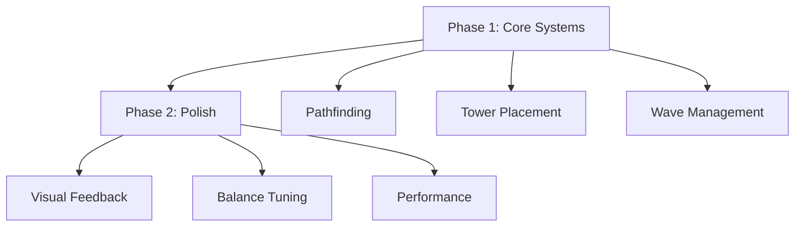

# Tower Defense MVP Implementation Plan

## Core Objectives
- Functional core gameplay loop
- Basic tower/enemy interactions
- Minimal viable performance
- Foundation for future scaling

## Phase Breakdown

### Included Features
- 3 Tower Types (Basic, AoE, Slow)
- 5 Enemy Types (Ground/Flying variants)
- Single Map with 2 Path Configurations
- Basic Currency System (Gold)
- Wave Progression with 10 Levels

### Technical Exclusions
- Complex upgrade systems
- Dynamic environment effects
- Multiplayer features
- Advanced AI behaviors
- Meta-progression systems

## Development Timeline

| Day | Focus Area | Key Deliverables |
|-----|------------|------------------|
| 1   | Foundation | Phaser setup, Core systems, Basic entities |
| 2   | Gameplay   | Tower mechanics, Enemy AI, Wave system |
| 3   | Polish     | UI elements, Balance passes, Performance |

## Technical Specifications
- **Engine**: Phaser 3.60+
- **Build System**: Webpack 5
- **Target FPS**: 60 (Desktop), 30 (Mobile)
- **Resolution**: 1280x720 (Scalable)
- **Asset Standards**: WebP images, OGG audio

## Risk Management
- Weekly playtesting sessions
- Automated build verification
- Feature flag system
- Rollback protocol
