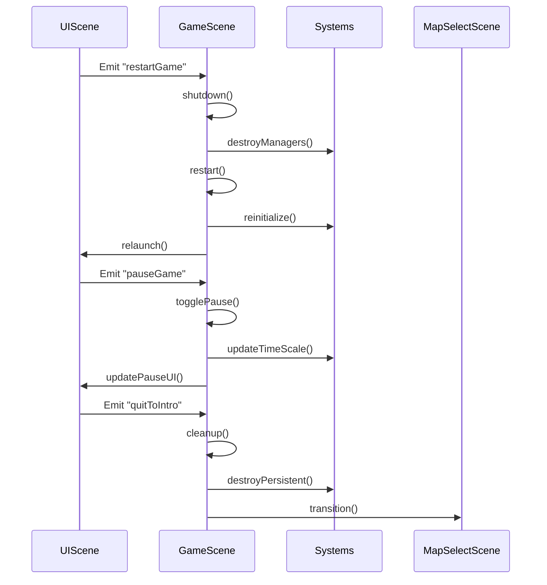

# Restart, Pause, and Quit Button Implementation Plan

## Overview

This document outlines the implementation plan for robust "Restart", "Pause", and "Quit to Main Menu" buttons in the Tower Defense game UI. The goal is to ensure safe, bug-free state transitions, preserving map and difficulty selection, and preventing memory leaks or state corruption.

---

## UI Button Implementation Flow

---

## GameScene.js: Shutdown and Cleanup

- **shutdown()** method will:
  - Signal cleanup to all entities (call preDestroy on towers, enemies, projectiles)
  - Destroy all system managers (WaveManager, PathManager, EconomyManager, AudioManager)
  - Remove all event listeners
  - Destroy all game objects (towers, enemies, projectiles, placementTiles, map)
  - Reset arrays to empty
  - Prepare for garbage collection

- **Manager destroy()** methods:
  - Stop timers and clear event listeners
  - Reset internal state

---

## Button Event Handling

- **Restart Button**: Emits "restartGame" event. GameScene performs full shutdown, then restarts with the same map and difficulty (read from registry).
- **Pause Button**: Emits "pauseGame" event. GameScene toggles pause state, updates time scale, and syncs UI.
- **Quit Button**: Emits "quitToIntro" event. GameScene and UIScene are stopped, and MapSelectScene is started.

---

## Validation Checklist

- Restart during enemy wave spawn
- Restart with many projectiles active
- Pause during tower placement
- Quit while audio is playing
- Rapid consecutive restarts
- No memory leaks or state corruption

---

## Risk Mitigation

- Object pooling for frequent restarts (future)
- State mutation locks during cleanup
- Promise-based async destruction (future)
- Memory leak detection hooks (future)

---

## Next Steps

1. Implement shutdown/cleanup logic in GameScene and managers.
2. Add UI buttons and event emitters in UIScene.
3. Wire up event listeners in GameScene.
4. Test all edge cases and update this document with findings.
