# Tower Defense Game Active Context

## Current Development Focus

The project is currently in the implementation phase of the MVP (Minimum Viable Product). The core architecture and systems have been established, and the focus is now on completing the remaining game mechanics and integrating all components into a fully playable game.

```mermaid
flowchart LR
    A[Project Setup] -->|Completed| B[Core Architecture]
    B -->|Completed| C[Entity Base Classes]
    C -->|Completed| D[Path System]
    D -->|Completed| E[Tower Placement]
    E -->|In Progress| F[Wave Management]
    F -.->|Next| G[Enemy AI]
    G -.->|Next| H[Collision System]
    H -.->|Next| I[Economy System]
    I -.->|Next| J[Testing & Balance]
```

## Recent Developments

### Completed
- Project setup with Webpack and Babel configuration
- Core game architecture with scene management
- Implementation of base entity classes (Tower, Enemy, Projectile)
- Path system for enemy movement
- Tower placement system on designated tiles
- Asset generation for placeholder graphics

### In Progress
- Wave management system for spawning enemies
- Integration of game systems (Path, Wave, Economy)
- UI scene for player interaction

## Current Challenges

### Technical Challenges
- Ensuring smooth performance with many entities on screen
- Balancing game difficulty across waves
- Implementing proper collision detection between projectiles and enemies
- Handling special cases like flying enemies and area effects

### Recent Bug Fixes
- Fixed errors that occurred when enemies were killed:
  1. `this.data.destroy is not a function` error
     - Root cause: Phaser's GameObject.destroy() method attempts to destroy all properties that have a destroy method
     - Solution: Added a custom destroy() method to the Enemy class that sets data to null before calling the parent destroy method
  
  2. `Cannot read properties of undefined (reading 'economyManager')` error
     - Root cause: The reference to scene was lost in the tween's onComplete callback after the enemy was destroyed
     - Solution: Stored references to scene and economyManager in local variables before setting up the tween

### Design Challenges
- Tuning tower and enemy parameters for balanced gameplay
- Creating intuitive UI for tower selection and placement
- Providing clear visual feedback for game events
- Ensuring the difficulty curve is appropriate

## Next Steps

### Immediate Tasks
1. Complete the wave manager integration with proper enemy spawning
2. Implement basic enemy AI with path following
3. Finalize collision detection between projectiles and enemies
4. Complete the economy system for resource management

### Short-term Goals
1. Implement all tower types with their special abilities
2. Create all enemy types with their unique characteristics
3. Balance tower costs, damage, and enemy health
4. Add visual and audio feedback for game events

### Medium-term Goals
1. Implement game state management (win/lose conditions)
2. Add tower upgrading functionality
3. Create additional maps with different layouts
4. Implement save/load functionality

## Decision Log

### Recent Decisions
- **Tower Types**: Limited to three distinct types (Basic, AoE, Slow) for MVP to ensure clear differentiation and balanced gameplay
- **Enemy Movement**: Implemented segment-based path following for smooth movement along predefined paths
- **Wave System**: Designed progressive wave system with increasing difficulty and enemy variety
- **UI Layout**: Created separate UI scene overlaid on game scene for cleaner architecture

### Pending Decisions
- How to handle tower upgrades (branching paths vs. linear progression)
- Visual effects for different tower attacks and enemy deaths
- Implementation of sound effects and background music
- Approach for saving game progress

## Integration Points

### Critical Integration Points
- **Tower-Enemy Interaction**: Towers need to target and damage enemies
- **Wave-Economy System**: Defeating enemies provides resources for tower placement
- **UI-Game Interaction**: Player actions in UI need to affect game state
- **Path-Enemy Connection**: Enemies need to follow the defined paths

### Testing Focus
- Tower targeting and firing mechanics
- Enemy path following and health management
- Wave progression and enemy spawning
- Resource management and tower placement
