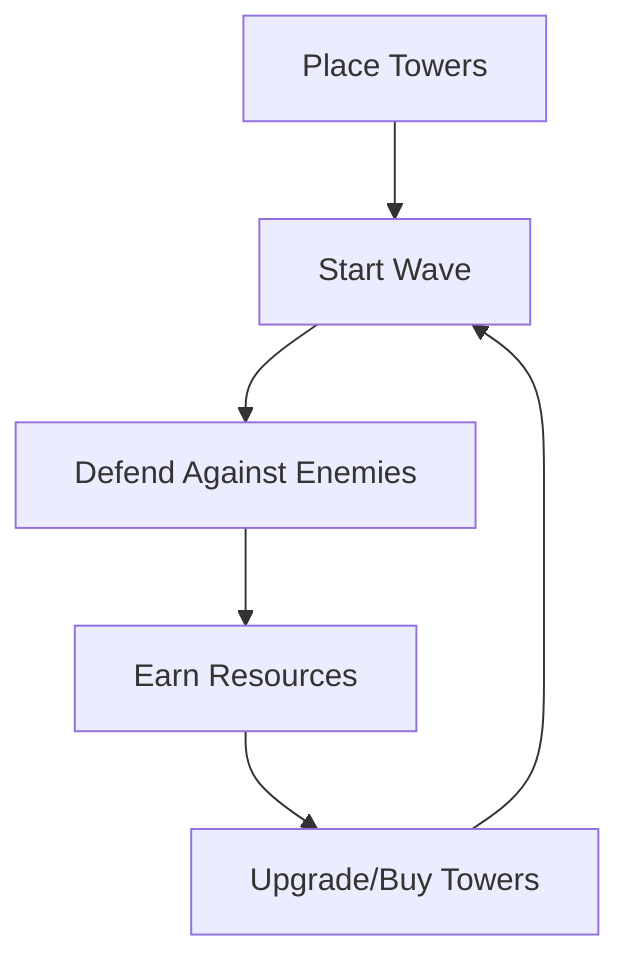

# Tower Defense Game Product Context

## Purpose & Vision
This tower defense game aims to provide an engaging strategic experience where players must make tactical decisions about tower placement, resource management, and prioritization of threats. The game balances accessibility for new players with depth for experienced strategy gamers.

## Target Experience
The game delivers a satisfying loop of planning, execution, and adaptation as players:
1. Analyze the map and enemy patterns
2. Make strategic decisions about tower placement
3. Manage limited resources (gold)
4. Adapt to changing threats during gameplay
5. Experience progression through increasingly challenging waves

## Core Gameplay Loop

## Player Motivation
Players are motivated by:
- **Strategic Mastery**: Finding optimal tower combinations and placements
- **Resource Management**: Making efficient use of limited gold
- **Progression**: Advancing through increasingly difficult waves
- **Challenge**: Overcoming the final boss wave

## User Experience Goals
- **Intuitive Controls**: Simple point-and-click interface for tower placement and management
- **Clear Feedback**: Visual and audio cues for important game events
- **Balanced Difficulty**: Progressive challenge that increases at a satisfying pace
- **Meaningful Choices**: Each tower type offers distinct advantages in different situations
- **Visual Clarity**: Easy to distinguish between different tower and enemy types

## Problem Solving
The game addresses several common issues in tower defense games:
1. **Difficulty Balance**: Carefully tuned waves that provide challenge without frustration
2. **Strategic Depth**: Multiple viable strategies rather than a single dominant approach
3. **Visual Clarity**: Clear visual design that communicates game state effectively
4. **Performance**: Optimized for smooth gameplay even with many entities on screen

## Player Personas

### Casual Strategy Fan
- Plays in short sessions
- Enjoys the core tower defense mechanics
- Appreciates visual feedback and satisfying victories
- May not optimize every aspect of their strategy

### Tactical Optimizer
- Seeks to find the most efficient tower placements
- Analyzes enemy patterns to maximize effectiveness
- Enjoys discovering synergies between different tower types
- Aims to complete the game with minimal resources spent

### Completionist
- Wants to master all aspects of the game
- Strives to defeat all waves with perfect scores
- Experiments with different strategies for replayability
- Appreciates the challenge of the final boss wave

## Success Criteria
The game will be considered successful if players:
- Complete multiple play sessions
- Experiment with different tower combinations
- Feel challenged but not frustrated by the difficulty curve
- Experience satisfaction when defeating waves, especially the boss wave
