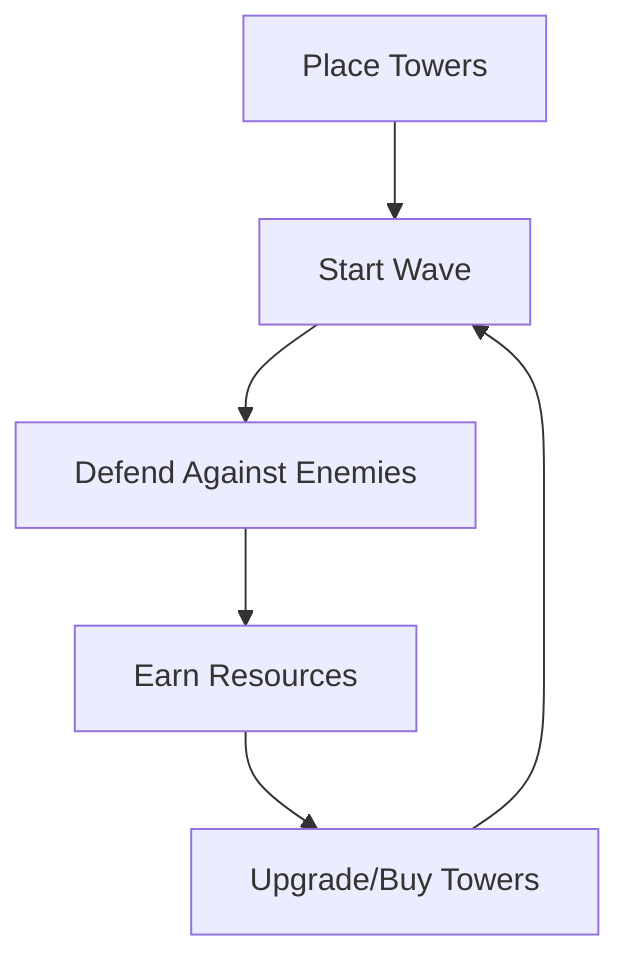

# Tower Defense Game Product Context

## Purpose & Vision
This tower defense game aims to provide an engaging strategic experience where players must make tactical decisions about tower placement, resource management, and prioritization of threats. The game balances accessibility for new players with depth for experienced strategy gamers.

## Target Experience
The game delivers a satisfying loop of planning, execution, and adaptation as players:
1. Analyze the map and enemy patterns
2. Make strategic decisions about tower placement
3. Manage limited resources (gold)
4. Adapt to changing threats during gameplay
5. Experience progression through increasingly challenging waves

## Core Gameplay Loop

## Player Motivation
Players are motivated by:
- **Strategic Mastery**: Finding optimal tower combinations and placements
- **Resource Management**: Making efficient use of limited gold
- **Progression**: Advancing through increasingly difficult waves
- **Challenge**: Overcoming the final boss wave

## User Experience Goals
- **Intuitive Controls**: Simple point-and-click interface for tower placement and management
- **Clear Feedback**: Visual and audio cues for important game events
- **Balanced Difficulty**: Progressive challenge that increases at a satisfying pace
- **Meaningful Choices**: Each tower type offers distinct advantages in different situations
- **Visual Clarity**: Easy to distinguish between different tower and enemy types

## Current Implementation Status
The game has implemented the core gameplay mechanics:
- Tower placement and targeting system
- Enemy path following and health management
- Wave-based progression system
- Economy system for resource management
- Basic UI for game interaction

The focus is now on refining these systems, balancing gameplay, and adding visual and audio feedback to enhance the player experience.

## Problem Solving
The game addresses several common issues in tower defense games:
1. **Difficulty Balance**: Carefully tuned waves that provide challenge without frustration
2. **Strategic Depth**: Multiple viable strategies rather than a single dominant approach
3. **Visual Clarity**: Clear visual design that communicates game state effectively
4. **Performance**: Optimized for smooth gameplay even with many entities on screen

## Player Personas

### Casual Strategy Fan
- Plays in short sessions
- Enjoys the core tower defense mechanics
- Appreciates visual feedback and satisfying victories
- May not optimize every aspect of their strategy

### Tactical Optimizer
- Seeks to find the most efficient tower placements
- Analyzes enemy patterns to maximize effectiveness
- Enjoys discovering synergies between different tower types
- Aims to complete the game with minimal resources spent

### Completionist
- Wants to master all aspects of the game
- Strives to defeat all waves with perfect scores
- Experiments with different strategies for replayability
- Appreciates the challenge of the final boss wave

## Game Features

### Tower Types
- **Basic Tower**: Standard attack tower with balanced stats
  - Medium range, medium damage, medium fire rate
  - Good all-around tower for general defense
  
- **Area of Effect (AoE) Tower**: Damages multiple enemies in a radius
  - Shorter range but damages all enemies in blast radius
  - Effective against groups of weaker enemies
  - Can target flying enemies
  
- **Slowing Tower**: Reduces enemy movement speed temporarily
  - Longer range but lower damage
  - Applies slowing effect to enemies
  - Can target flying enemies
  - Strategic value in slowing enemies for other towers to hit

### Enemy Types
- **Basic Enemy**: Standard enemy with balanced stats
  - Medium health, medium speed
  - No special abilities
  
- **Fast Enemy**: Moves quickly but has less health
  - Low health, high speed
  - Requires quick targeting or slowing effects
  
- **Armored Enemy**: High health and damage resistance
  - High health, low speed
  - Damage reduction from attacks
  - Requires sustained damage to defeat
  
- **Flying Enemy**: Can only be targeted by certain towers
  - Medium health, medium speed
  - Can only be targeted by AoE and Slowing towers
  - Requires strategic tower placement
  
- **Boss Enemy**: Extremely powerful enemy that appears in the final wave
  - Very high health, low speed
  - Damage reduction from attacks
  - Requires coordinated defense to defeat

### Game Mechanics
- **Path-based Movement**: Enemies follow predefined paths
- **Tower Targeting**: Towers automatically target enemies within range
- **Resource Management**: Players earn gold by defeating enemies
- **Wave Progression**: Increasing difficulty with each wave
- **Lives System**: Players lose lives when enemies reach the end of the path

## Success Criteria
The game will be considered successful if players:
- Complete multiple play sessions
- Experiment with different tower combinations
- Feel challenged but not frustrated by the difficulty curve
- Experience satisfaction when defeating waves, especially the boss wave
