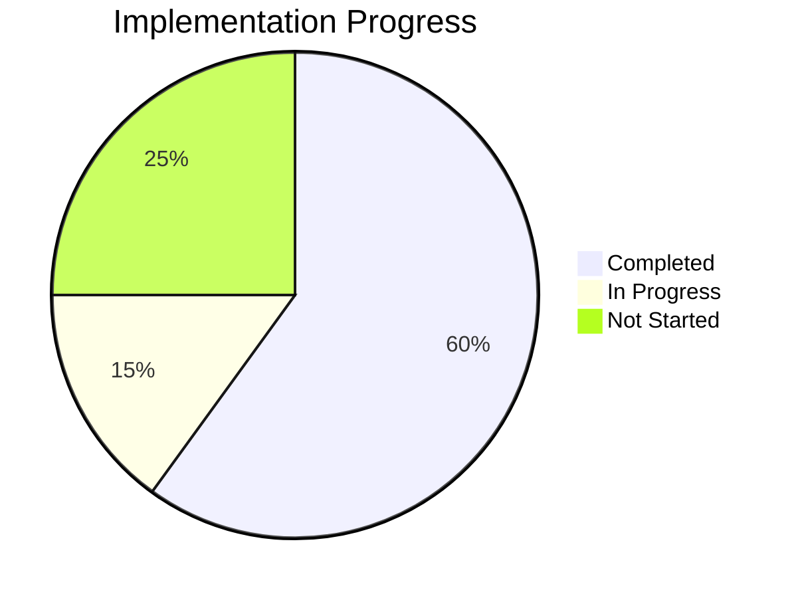

# Tower Defense Game Progress Tracker

## Implementation Status

## Completed Features

### Core Systems
- ✅ Project setup and build configuration
- ✅ Game initialization and scene management
- ✅ Path system for enemy movement
- ✅ Tower placement on designated tiles
- ✅ Basic game loop with update cycles

### Entities
- ✅ Tower base class with targeting logic
- ✅ Enemy base class with path following
- ✅ Projectile base class with movement

### UI Elements
- ✅ Game UI layout with top and bottom bars
- ✅ Tower selection interface
- ✅ Resource display (lives, gold)
- ✅ Wave information display

### Assets
- ✅ Basic placeholder assets for towers, enemies, and projectiles
- ✅ Map tiles for background, path, and placement areas

## In Progress Features

### Systems
- 🔄 Wave management system for enemy spawning
- 🔄 Economy system for resource management
- 🔄 Collision detection between projectiles and enemies

### Gameplay
- 🔄 Tower special abilities (AoE damage, slowing effect)
- 🔄 Enemy variety implementation (flying, armored types)

## Not Started Features

### Core Gameplay
- ❌ Game state management (victory/defeat conditions)
- ❌ Tower upgrading system
- ❌ Score tracking and display

### Polish
- ❌ Sound effects and background music
- ❌ Visual effects for attacks and deaths
- ❌ Game balance tuning
- ❌ Tutorial or help system

### Additional Content
- ❌ Multiple maps with different layouts
- ❌ Additional tower and enemy types beyond MVP
- ❌ Save/load functionality

## Known Issues

### Bugs
- None documented yet - initial implementation phase

### Performance Concerns
- Potential performance issues with many entities on screen (to be tested)
- Collision detection may need optimization for larger enemy counts

### Design Issues
- Tower balance needs tuning once all types are implemented
- Wave difficulty progression needs adjustment after testing

## Testing Status

### Unit Testing
- ❌ Path system validation
- ❌ Tower targeting verification
- ❌ Enemy movement accuracy
- ❌ Projectile collision detection

### Integration Testing
- ❌ Tower-Enemy interaction
- ❌ Wave-Economy system integration
- ❌ UI-Game interaction

### Playability Testing
- ❌ Difficulty curve assessment
- ❌ Resource balance evaluation
- ❌ Overall game feel and pacing

## Next Milestone Goals

### Milestone 1: Core Gameplay Loop (Current)
- Complete wave management system
- Implement basic enemy AI
- Finalize collision detection
- Complete economy system

### Milestone 2: Full MVP Implementation
- Implement all tower types with special abilities
- Create all enemy types with unique characteristics
- Add game state management (win/lose conditions)
- Balance tower costs, damage, and enemy health

### Milestone 3: Polish and Refinement
- Add visual and audio feedback
- Implement tower upgrading
- Create additional maps
- Add tutorial elements
- Perform comprehensive game balance

## Development Velocity

### Recent Progress
- Completed core architecture and entity base classes
- Implemented path system and tower placement
- Created basic UI elements and displays

### Blockers
- None currently identified

### Acceleration Opportunities
- Reuse collision detection code from projectiles for other game elements
- Leverage Phaser's built-in physics for some interactions
- Implement template pattern for tower and enemy variations
