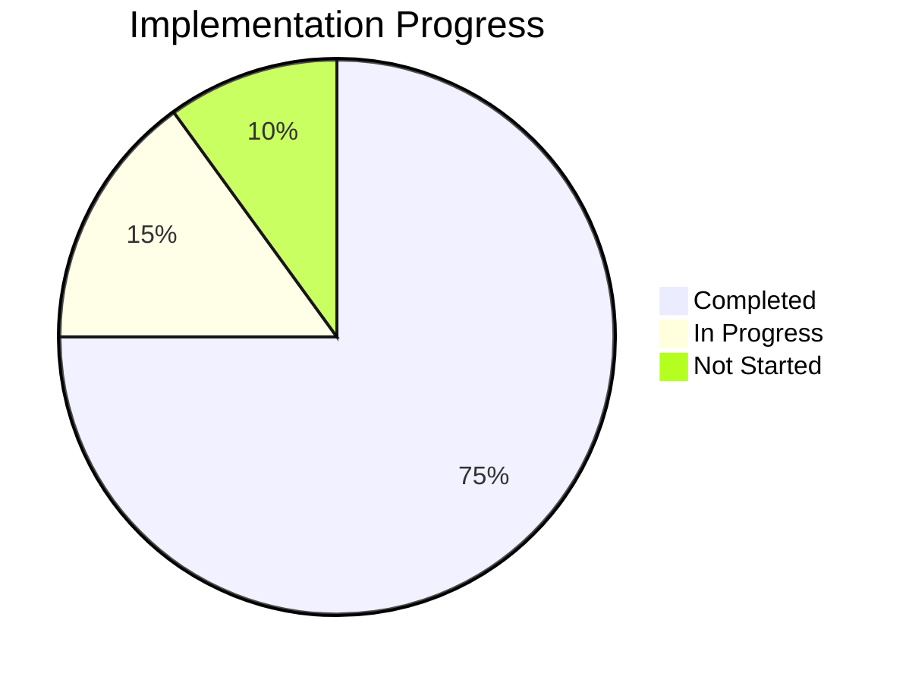

# Tower Defense Game Progress Tracker

_Last Memory Bank Review: 17.4.2025, 15:50 (Europe/Berlin) — All memory bank files reviewed and current._

## Implementation Status

## Completed Features

### Core Systems
- ✅ Project setup and build configuration
- ✅ Game initialization and scene management
- ✅ Path system for enemy movement
- ✅ Tower placement on designated tiles
- ✅ Basic game loop with update cycles
- ✅ Wave management system for enemy spawning
- ✅ Economy system for resource management
- ✅ Collision detection between projectiles and enemies
- ✅ Victory banner implementation

### Entities
- ✅ Tower base class with targeting logic
- ✅ Enemy base class with path following
- ✅ Projectile base class with movement
- ✅ Tower special abilities (basic implementation)
- ✅ Enemy variety (basic implementation)

### UI Elements
- ✅ Game UI layout with top and bottom bars
- ✅ Tower selection interface
- ✅ Resource display (lives, gold)
- ✅ Wave information display
- ✅ Wave control button

### Assets
- ✅ Basic placeholder assets for towers, enemies, and projectiles
- ✅ Map tiles for background, path, and placement areas

## In Progress Features

### Gameplay
- 🔄 Tower special abilities refinement (AoE damage, slowing effect)
- 🔄 Enemy variety refinement (flying, armored types)
- 🔄 Game balance tuning (difficulty curve, resource tuning)
- 🔄 Visual and audio feedback for game events (attacks, deaths, UI)
- 🔄 Defeat condition and defeat screen improvement

### Systems
- 🔄 Game state management (victory implemented, defeat needs improvement)
- 🔄 Score tracking and display

## Not Started Features

### Polish
- ❌ Sound effects and background music
- ❌ Advanced visual effects for attacks and deaths
- ❌ Tutorial or help system

### Additional Content
- ❌ Multiple maps with different layouts
- ❌ Tower upgrading system
- ❌ Additional tower and enemy types beyond MVP
- ❌ Save/load functionality

## Known Issues

### Bugs
- None currently identified - recent enemy destruction bugs have been fixed

### Performance Concerns
- Potential performance issues with many entities on screen (to be tested)
- Collision detection may need optimization for larger enemy counts

### Design Issues
- Tower balance needs tuning once all types are fully implemented
- Wave difficulty progression needs adjustment after testing
- Visual feedback for game events needs improvement

## Testing Status

### Unit Testing
- ❌ Path system validation
- ❌ Tower targeting verification
- ❌ Enemy movement accuracy
- ❌ Projectile collision detection

### Integration Testing
- 🔄 Tower-Enemy interaction
- 🔄 Wave-Economy system integration
- 🔄 UI-Game interaction

### Playability Testing
- 🔄 Difficulty curve assessment
- 🔄 Resource balance evaluation
- 🔄 Overall game feel and pacing

## Next Milestone Goals

### Milestone 1: Core Gameplay Loop (Completed)
- ✅ Complete wave management system
- ✅ Implement basic enemy AI
- ✅ Finalize collision detection
- ✅ Complete economy system

### Milestone 2: Full MVP Implementation (Current)
- ✅ Implement all tower types with special abilities (final polish in progress)
- ✅ Create all enemy types with unique characteristics (final polish in progress)
- ✅ Add game state management (victory implemented, defeat needs improvement)
- 🔄 Balance tower costs, damage, and enemy health

### Milestone 3: Polish and Refinement (Next)
- 🔄 Add visual and audio feedback
- 🔄 Improve defeat screen and add game statistics
- ❌ Implement tower upgrading
- ❌ Create additional maps
- ❌ Add tutorial elements
- ❌ Perform comprehensive game balance

## Development Velocity

### Recent Progress
- Fixed critical bugs in enemy destruction
- Completed core gameplay loop
- Implemented basic tower special abilities
- Created enemy variety with different characteristics
- Implemented victory banner
- Fixed HMR bug in Webpack config

### Blockers
- None currently identified

### Acceleration Opportunities
- Reuse collision detection code from projectiles for other game elements
- Leverage Phaser's built-in physics for some interactions
- Implement template pattern for tower and enemy variations

## Progress Log

### Task 1.1 - Extract common utilities into `/src/utils/`
- **Implemented Features**: Created `src/utils/math.js` with math helpers (`distance`, `lerp`, `angleBetween`) and refactored `PathManager.js` to use these utilities.
- **Encountered Errors**: None.
- **Fixes Applied**: N/A.

### Victory Banner Implementation

- **Implemented Features**: Added a victory banner in `GameScene.js` that displays when all waves are successfully defended. The banner includes a semi-transparent background, 'VICTORY!' text in gold, and instructions to click to return to the main menu. A `gameEnded` flag was also added to prevent multiple banners from showing.
- **Implementation Details**: 
  - Created a dedicated `showVictoryBanner()` method in GameScene.js
  - Added a semi-transparent black background covering 60% of the game width and 40% of the height
  - Implemented gold-colored 'VICTORY!' text with black stroke for better visibility
  - Added white instruction text "Click to return to main menu"
  - Set up click handler to return to the map select scene
  - Added animation effects: victory text scales in, instruction text fades in with delay
  - Implemented gameEnded flag to prevent multiple banners from appearing
- **Encountered Errors**: Previously faced syntax errors due to an unterminated string literal in the victory banner text caused by an improper line break.
- **Fixes Applied**: Corrected the syntax error by properly escaping the line break in the string, resolving all related lint errors.

### HMR Bug Fix in Webpack Config

- **Implemented Features**: Fixed the Hot Module Replacement (HMR) error by updating the webpack configuration.
- **Encountered Errors**: Error message 'HMR is not implemented for module chunk format yet' appeared on the command line after code changes.
- **Fixes Applied**: Removed the `experiments.outputModule` setting from `webpack.config.js` as it was conflicting with HMR functionality.

### Task 1.2 - Convert Scenes & Entities to ES6 modules
- **Implemented Features**: Converted each Scene and Entity to ES6 modules with proper `import`/`export` statements and updated all import paths.
- **Encountered Errors**: None.
- **Fixes Applied**: Ensured consistent module structure and file naming.

### Task 1.3 - Introduce EventEmitter utility
- **Implemented Features**: Created `src/utils/EventEmitter.js`; refactored Tower and UIScene to use global emitter for `showTowerInfo` events.
- **Encountered Errors**: None.
- **Fixes Applied**: N/A.

### Task 1.4 - Externalize configuration data
- **Implemented Features**: Moved towers, waves, extra waves into JSON under `/src/assets/config` and maps into `/public/maps`; updated `index.js` to import JSON configs and MapManager to load maps.
- **Encountered Errors**: None.
- **Fixes Applied**: Updated code to reference JSON configurations.

### Task 1.5 - Fix tower info panel listener context
- **Implemented Features**: Bound `showTowerInfo` listener via arrow function in UIScene.js to preserve scene this context.
- **Encountered Errors**: Uncaught TypeError: Cannot read properties of undefined (reading 'towerInfoPanel') when selecting a tower.
- **Fixes Applied**: Updated `emitter.on('showTowerInfo', ...)` to use `(tower) => this.showTowerInfo(tower)` ensuring `this.towerInfoPanel` is defined correctly.

### GameScene Complexity Reduction (2025-04-17)
- **Implemented Features**: Added a detailed, actionable task list to `docs/implementation-plan.md` under section 7, outlining the process for reducing complexity in `GameScene.js` by extracting complex logic into helper modules/classes and integrating them back into the scene.
- **Encountered Errors**: No errors encountered during this documentation update step.
- **How Errors Were Fixed**: N/A

### GameScene Complexity Reduction: Collision & Effect Logic Modularized (2025-04-17)
- **Implemented Features**: Extracted collision handling into `CollisionManager.js` and effect spawning into `EffectSpawner.js`. Updated `GameScene.js` to use these helpers, removed redundant methods, and delegated responsibilities accordingly. All logic for projectile-enemy collisions and hit/explosion effects is now modularized.
- **Encountered Errors**: No errors encountered during refactor and extraction.
- **How Errors Were Fixed**: N/A

### Event System Standardization Checklist & Audit (2025-04-17)
- **Implemented Features**: Added an implementation checklist for Event System Standardization to `docs/implementation-plan.md`. Audited the codebase and confirmed all custom emitter usages and the utility file are removed. All events now use Phaser’s event system, with code comments clarifying event usage.
- **Encountered Errors**: No errors encountered during audit and checklist implementation.
- **How Errors Were Fixed**: N/A
