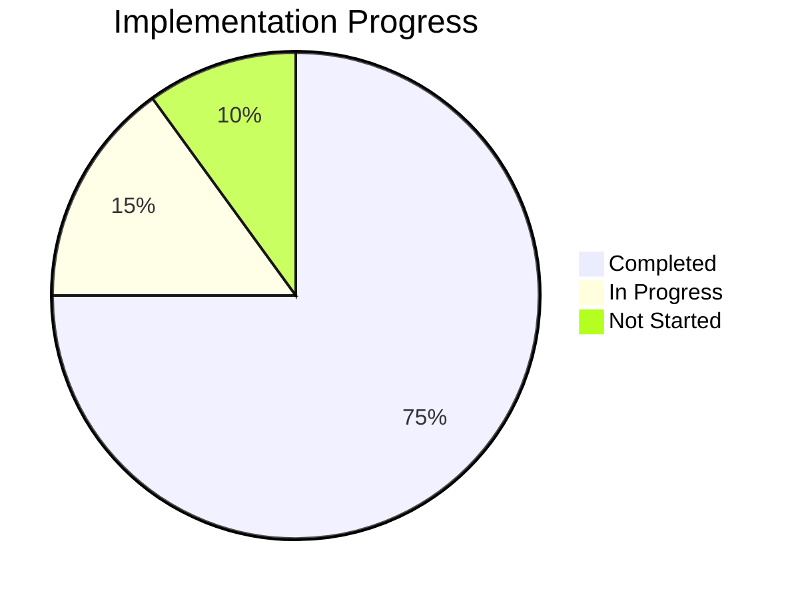

# Tower Defense Game Progress Tracker

## Implementation Status

## Completed Features

### Core Systems
- ✅ Project setup and build configuration
- ✅ Game initialization and scene management
- ✅ Path system for enemy movement
- ✅ Tower placement on designated tiles
- ✅ Basic game loop with update cycles
- ✅ Wave management system for enemy spawning
- ✅ Economy system for resource management
- ✅ Collision detection between projectiles and enemies

### Entities
- ✅ Tower base class with targeting logic
- ✅ Enemy base class with path following
- ✅ Projectile base class with movement
- ✅ Tower special abilities (basic implementation)
- ✅ Enemy variety (basic implementation)

### UI Elements
- ✅ Game UI layout with top and bottom bars
- ✅ Tower selection interface
- ✅ Resource display (lives, gold)
- ✅ Wave information display
- ✅ Wave control button

### Assets
- ✅ Basic placeholder assets for towers, enemies, and projectiles
- ✅ Map tiles for background, path, and placement areas

## In Progress Features

### Gameplay
- 🔄 Tower special abilities refinement (AoE damage, slowing effect)
- 🔄 Enemy variety refinement (flying, armored types)
- 🔄 Game balance tuning
- 🔄 Visual feedback for game events

### Systems
- 🔄 Game state management (victory/defeat conditions)
- 🔄 Score tracking and display

## Not Started Features

### Polish
- ❌ Sound effects and background music
- ❌ Advanced visual effects for attacks and deaths
- ❌ Tutorial or help system

### Additional Content
- ❌ Multiple maps with different layouts
- ❌ Tower upgrading system
- ❌ Additional tower and enemy types beyond MVP
- ❌ Save/load functionality

## Known Issues

### Bugs
- None currently identified - recent enemy destruction bugs have been fixed

### Performance Concerns
- Potential performance issues with many entities on screen (to be tested)
- Collision detection may need optimization for larger enemy counts

### Design Issues
- Tower balance needs tuning once all types are fully implemented
- Wave difficulty progression needs adjustment after testing
- Visual feedback for game events needs improvement

## Testing Status

### Unit Testing
- ❌ Path system validation
- ❌ Tower targeting verification
- ❌ Enemy movement accuracy
- ❌ Projectile collision detection

### Integration Testing
- 🔄 Tower-Enemy interaction
- 🔄 Wave-Economy system integration
- 🔄 UI-Game interaction

### Playability Testing
- 🔄 Difficulty curve assessment
- 🔄 Resource balance evaluation
- 🔄 Overall game feel and pacing

## Next Milestone Goals

### Milestone 1: Core Gameplay Loop (Completed)
- ✅ Complete wave management system
- ✅ Implement basic enemy AI
- ✅ Finalize collision detection
- ✅ Complete economy system

### Milestone 2: Full MVP Implementation (Current)
- 🔄 Implement all tower types with special abilities
- 🔄 Create all enemy types with unique characteristics
- 🔄 Add game state management (win/lose conditions)
- 🔄 Balance tower costs, damage, and enemy health

### Milestone 3: Polish and Refinement (Next)
- ❌ Add visual and audio feedback
- ❌ Implement tower upgrading
- ❌ Create additional maps
- ❌ Add tutorial elements
- ❌ Perform comprehensive game balance

## Development Velocity

### Recent Progress
- Fixed critical bugs in enemy destruction
- Completed core gameplay loop
- Implemented basic tower special abilities
- Created enemy variety with different characteristics

### Blockers
- None currently identified

### Acceleration Opportunities
- Reuse collision detection code from projectiles for other game elements
- Leverage Phaser's built-in physics for some interactions
- Implement template pattern for tower and enemy variations
