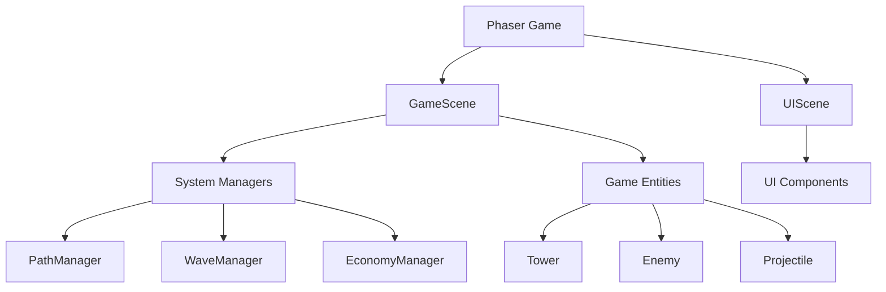
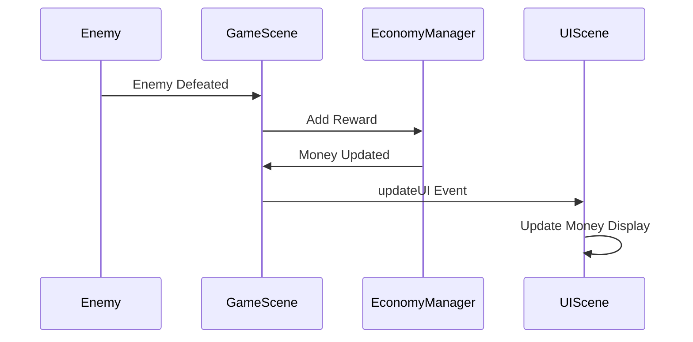

# Tower Defense Game System Patterns

## Architecture Overview

The game follows a component-based architecture with clear separation of concerns. The main architectural patterns include:

## Core Design Patterns

### Scene Management Pattern
The game uses Phaser's scene system to separate game logic from UI:
- **GameScene**: Handles game mechanics, entities, and systems
- **UIScene**: Manages user interface elements and player interaction

These scenes run in parallel, with the UIScene overlaid on top of the GameScene. They communicate via Phaser's event system.

### Entity Component Pattern
Game objects are implemented as self-contained entities with their own update logic:
- **Tower**: Handles targeting, firing, and upgrades
- **Enemy**: Manages path following, health, and effects
- **Projectile**: Controls movement and collision detection

Each entity encapsulates its own state and behavior while interacting with other entities through well-defined interfaces.

### System Manager Pattern
Complex game systems are abstracted into manager classes:
- **PathManager**: Handles path definition and calculations
- **WaveManager**: Controls enemy wave spawning and progression
- **EconomyManager**: Manages player resources and scoring

These managers provide services to the game scene and entities, maintaining their own internal state.

### Event-Driven Communication
The game uses Phaser's event system for loose coupling between components:
- Game events (wave start/end, enemy death, etc.) are broadcast
- Components subscribe to relevant events
- UI updates are triggered via events from the game scene

### Factory Method Pattern
The GameScene acts as a factory for game entities:
- `spawnEnemy()`: Creates enemy instances
- `spawnProjectile()`: Creates projectile instances

This centralizes entity creation and ensures proper initialization.

## Data Flow Patterns

### Game State Management
Game state flows through the system in a predictable pattern:
1. User input is captured by the UIScene
2. Commands are sent to the GameScene
3. GameScene updates relevant systems and entities
4. Systems and entities update their internal state
5. Changes are reflected back to the UI via events

### Tower Targeting System
Towers use a priority-based targeting system:
1. Tower scans for enemies within range
2. Enemies are filtered based on tower capabilities (e.g., can hit flying)
3. Closest enemy is selected as target
4. Tower tracks target until it's defeated or out of range

### Enemy Path Following
Enemies follow paths using a segment-based approach:
1. Path is defined as a series of points
2. Enemy moves from point to point along segments
3. Movement is interpolated for smooth transitions
4. Progress is tracked as a combination of segment index and position (t) within segment

## Optimization Patterns

### Object Pooling (Planned)
Future optimization will implement object pooling for frequently created/destroyed objects:
- Projectiles
- Visual effects
- Enemy instances

### Spatial Partitioning (Planned)
For larger maps with many entities, spatial partitioning will optimize:
- Tower targeting calculations
- Collision detection
- Rendering optimizations

## Extension Points

The architecture provides several clean extension points:

### New Tower Types
Adding new tower types requires:
1. Creating tower data in GAME_SETTINGS.TOWERS
2. Adding tower assets
3. Implementing any special behavior in Tower class

### New Enemy Types
Adding new enemy types requires:
1. Creating enemy data in GAME_SETTINGS.ENEMIES
2. Adding enemy assets
3. Implementing any special behavior in Enemy class

### New Maps
The map system can be extended by:
1. Creating new path configurations
2. Defining placement tile positions
3. Adding visual assets for the map theme
