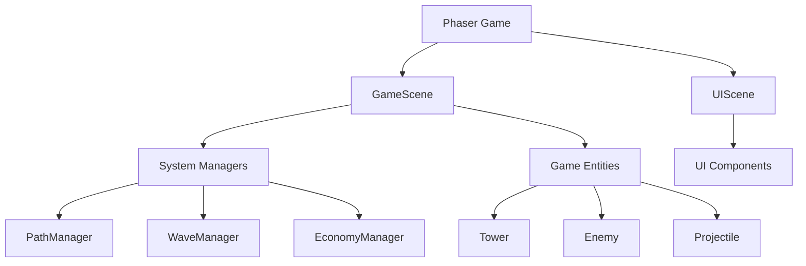
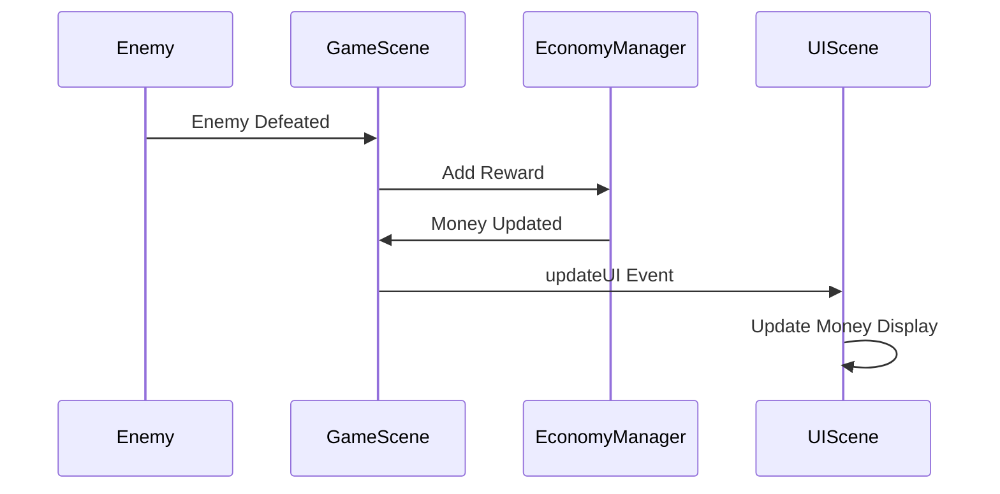

# Tower Defense Game System Patterns

## Architecture Overview

The game follows a component-based architecture with clear separation of concerns. The main architectural patterns include:

## Core Design Patterns

### Scene Management Pattern
The game uses Phaser's scene system to separate game logic from UI:
- **GameScene**: Handles game mechanics, entities, and systems
- **UIScene**: Manages user interface elements and player interaction

These scenes run in parallel, with the UIScene overlaid on top of the GameScene. They communicate via Phaser's event system.

### Entity Component Pattern
Game objects are implemented as self-contained entities with their own update logic:
- **Tower**: Handles targeting, firing, upgrades, and special mechanics
  - **Advanced Towers**:
    - **MultiShotTower**: Fires at multiple targets simultaneously
    - **SupportTower**: Buffs nearby towers (e.g., increased fire rate)
    - **SniperTower**: Long-range, high-damage single-target attacks
  - Towers use config-driven properties for cost, damage, range, fire rate, and upgrade scaling.
- **Enemy**: Manages path following, health, effects, and special abilities
  - **Advanced Enemies**:
    - **HealerEnemy**: Heals itself or other enemies over time
    - **ShieldEnemy**: Activates a shield to absorb damage
    - **SplitEnemy**: Splits into smaller enemies upon death
    - **TeleportEnemy**: Teleports forward along the path
  - Enemies use config-driven properties for health, speed, resistances, and abilities.
- **Projectile**: Controls movement, collision detection, and area-of-effect (AoE) or slow effects

Each entity encapsulates its own state and behavior while interacting with other entities through well-defined interfaces.

### System Manager Pattern
Complex game systems are abstracted into manager classes:
- **PathManager**: Handles path definition and calculations
- **WaveManager**: Controls enemy wave spawning, progression, and extra/boss waves using config-driven data
- **EconomyManager**: Manages player resources, scoring, bonuses, and statistics
- **AudioManager**: Loads and plays sound effects and music, manages volume/mute state
- **MapManager**: Handles loading, selection, and switching of multiple maps

These managers provide services to the game scene and entities, maintaining their own internal state.

### Event-Driven Communication
The game uses Phaser's event system and a custom EventEmitter utility for loose coupling between components:
- Game events (wave start/end, enemy death, tower info, etc.) are broadcast
- Components subscribe to relevant events
- UI and audio feedback are triggered via events from the game scene and systems
- EventEmitter utility provides a decoupled publish/subscribe pattern for custom events

### Factory Method Pattern
The GameScene acts as a factory for game entities:
- `spawnEnemy()`: Creates enemy instances, including advanced types based on config
- `spawnProjectile()`: Creates projectile instances, including AoE and slow projectiles

This centralizes entity creation and ensures proper initialization.

### Strategy Pattern
Different tower and enemy types implement different strategies:
- Tower targeting strategies (closest, strongest, first, multi-target)
- Enemy movement strategies (ground, flying, teleporting)
- Tower attack strategies (single target, area effect, slowing, buffing)
- Enemy defense strategies (shielding, healing, splitting)

### Observer Pattern
The game uses an observer pattern for UI and audio updates:
- Game state changes are observed by the UI (UIScene)
- UI components update in response to state changes (resources, wave info, tower info, messages)
- AudioManager responds to events for sound/music feedback
- This keeps the UI and audio in sync with the game state

## Data Flow Patterns

### Game State Management
Game state flows through the system in a predictable pattern:
1. User input is captured by the UIScene
2. Commands are sent to the GameScene
3. GameScene updates relevant systems and entities
4. Systems and entities update their internal state
5. Changes are reflected back to the UI via events

### Tower Targeting System
Towers use a priority-based targeting system:
1. Tower scans for enemies within range
2. Enemies are filtered based on tower capabilities (e.g., can hit flying)
3. Closest enemy is selected as target
4. Tower tracks target until it's defeated or out of range

### Enemy Path Following
Enemies follow paths using a segment-based approach:
1. Path is defined as a series of points
2. Enemy moves from point to point along segments
3. Movement is interpolated for smooth transitions
4. Progress is tracked as a combination of segment index and position (t) within segment

### Projectile Tracking
Projectiles use a target-based movement system:
1. Projectile is created with a reference to its target
2. Projectile calculates angle to target each frame
3. If target is lost, projectile continues in last known direction
4. Collision detection checks for hits with enemies

## Error Handling Patterns

### Custom Destroy Pattern
To handle Phaser's automatic destruction of object properties:
1. Custom destroy methods are implemented in entity classes
2. References to plain objects are nullified before calling parent destroy
3. Local variables are used to store references needed in callbacks

### Event-Based Error Recovery
The game uses events to handle and recover from errors:
1. Critical errors are broadcast as events
2. Error handlers can respond appropriately
3. The game can continue running even if some components fail

## Optimization Patterns

### Object Pooling (Planned)
Future optimization will implement object pooling for frequently created/destroyed objects:
- Projectiles
- Visual effects
- Enemy instances

### Spatial Partitioning (Planned)
For larger maps with many entities, spatial partitioning will optimize:
- Tower targeting calculations
- Collision detection
- Rendering optimizations

## Extension Points

The architecture provides several clean extension points:

### New Tower Types
Adding new tower types requires:
1. Creating tower data in GAME_SETTINGS.TOWERS
2. Adding tower assets
3. Implementing any special behavior in Tower class

### New Enemy Types
Adding new enemy types requires:
1. Creating enemy data in GAME_SETTINGS.ENEMIES
2. Adding enemy assets
3. Implementing any special behavior in Enemy class

### New Maps
The map system can be extended by:
1. Creating new path configurations
2. Defining placement tile positions
3. Adding visual assets for the map theme
